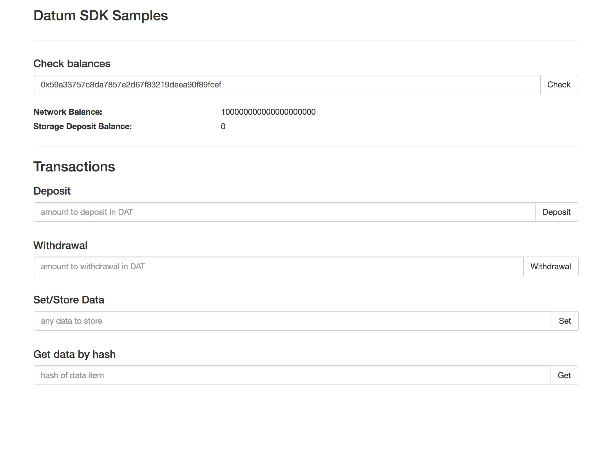
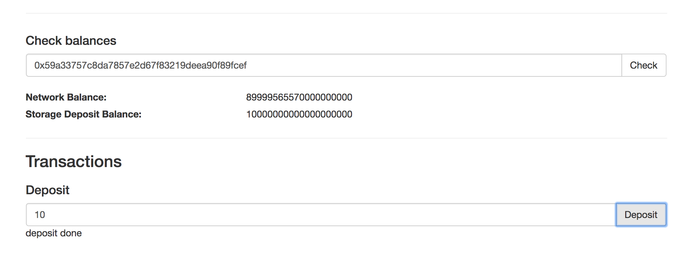
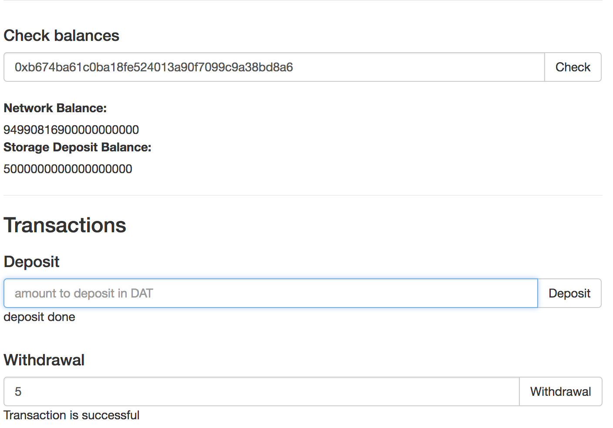
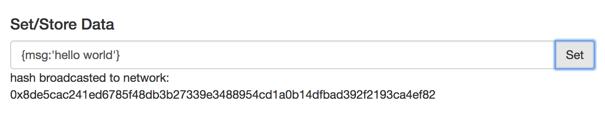
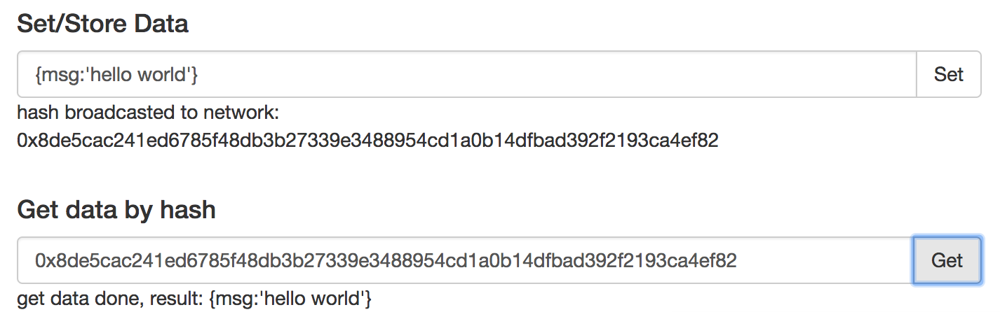

# Datum API Example Util


### Preface

The following is basic util app that provide with the SDK user with an idea on how to go about using SDK functionalities.

The following util app show case how to:

-  Generate new datum identity.
-  Request DAT from test net faucet.
-  Deposit DAT to storage contract.
-  Withdraw DAT from Storage contract to user account.
-  Store data to storage account.
-  Retrieve data from storage account.


### Project Folder Structure

Project structure is very simple html page with some JS code where all functionalities resides.

```
examples/
         index.html
         js/
            utils.js
```

For more information please check the utils.js code.


### Work Flow

Once you open the page the JS code kick start the following operations:

1. Create New Datum Id & initialise it.
2. Request 100 DAT to the newly generated account.
3. Update account balance to reflect current account Balance.

After that to be able to interact with storage contract __you will need to deposit some DAT to the storage contract__.

#### Deposit


As shown you can deposit X number of DAT to the storage contract. To do that insert number of DAT you want to deposit, then press Deposit button.

You balance will get updated once deposit is successful, or you will see an error msg.

#### Withdraw


Withdrawal from the storage contract works in the same way as deposit. You just need to enter how many DAT you want to withdraw and your balance will get updated once transaction pass.

#### Saving Data

DATUM-SDK provide the users with complex saving storage options to meet their need, for the same of this example we will keep it simple.

To save data to Datum storage nodes, you can insert the data you want to save in the set/store data input field. Once data is saved you will be provided by Key that you can use later to retrieve the data.

#### Retrieve Data


To be able to retrieve the stored data, you will need to have the key/ID
used to store the data. In this example you can see we have used the same key we used to store the data to retrieve our Hello world msg.
